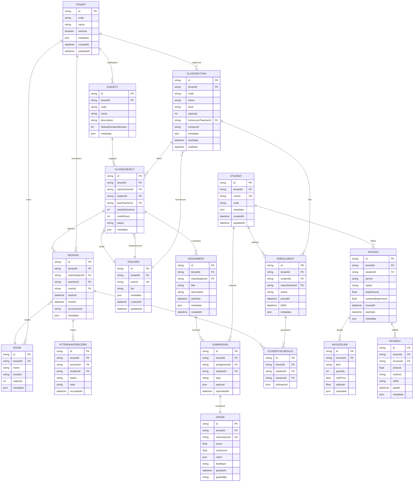

# LMS Database Diagram – Version 2 (Multi-Subject Scheduling)

> `CLASSSECTION` maps to the existing `Class` table. `CLASSSUBJECT` introduces the many-to-many between classes and subjects, and `STUDENTSCHEDULE` is a materialized view (or denormalized table) for quick timetable queries.
