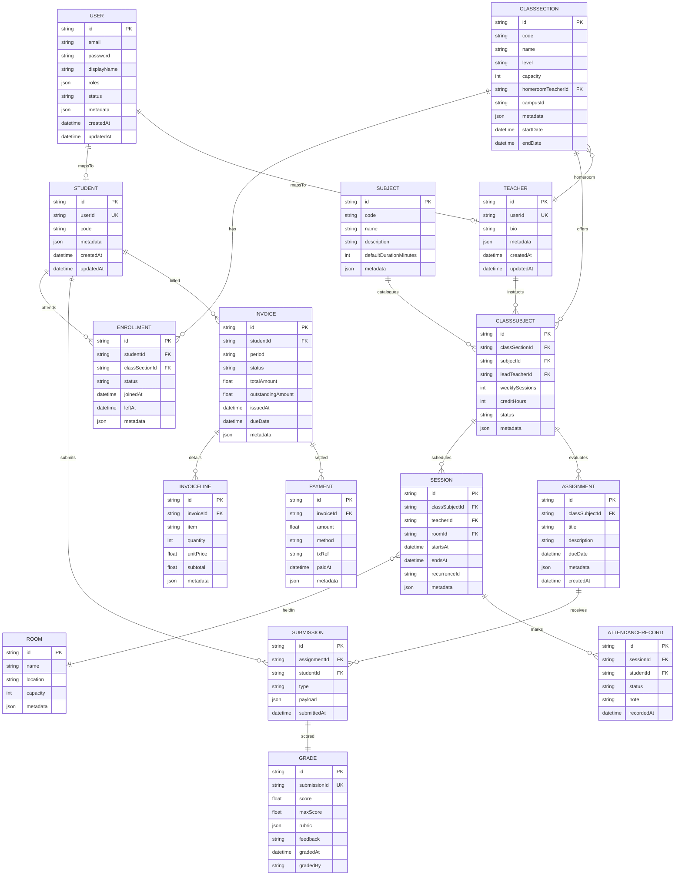

# LMS Database Diagram – Version 3 (Single-Tenant Deployment)

> All multi-tenant discriminator columns (`tenantId`) and the `Tenant` table are removed. Each deployment runs isolated for a single institution. `CLASSSECTION` aligns with the previous `Class` table name.
