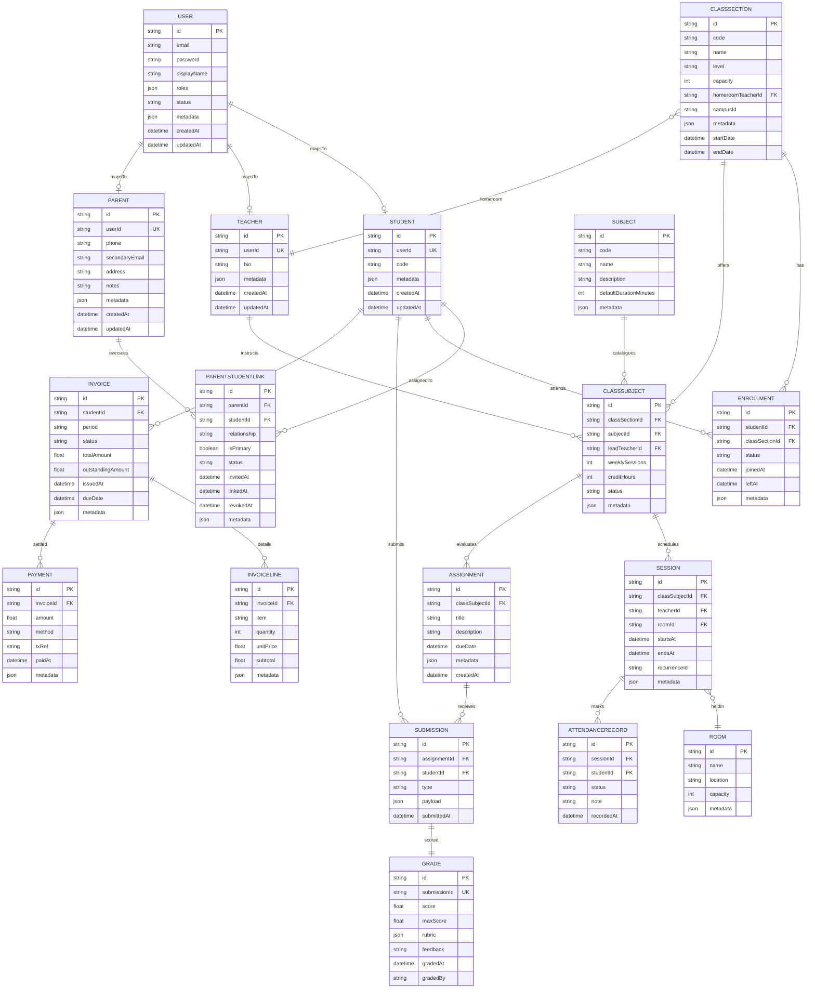

# LMS Database Diagram - Version 4 (Parent Engagement Enhancements)

> Version 4 introduces guardian support. Each parent is a specialized `USER` who links to one or more students via `PARENTSTUDENTLINK`, enabling guardians to monitor attendance, schedules, grades, and invoices without duplicating student records.
