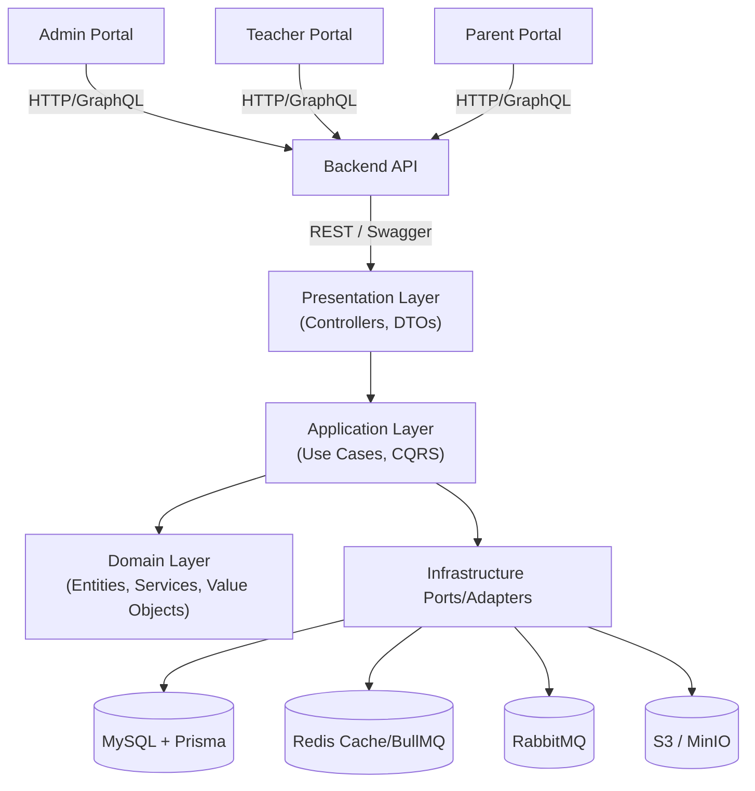
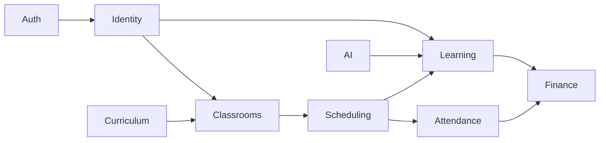

# LMS Backend Architecture

## High-Level Context

## Module Interaction Overview

## Directory Mapping
- `src/modules/<context>` – DDD bounded contexts.
- `src/common` – Cross-cutting concerns (decorators, middleware).
- `src/infrastructure/database` – Prisma integration, global DB module.
- `prisma/schema.prisma` – Single-tenant database schema.

## Deployment Notes
- Each customer runs an isolated instance (app + database).
- Data model embraces `Subject`, `ClassSection`, `ClassSubject`, `Session`, and `Room` to support multi-subject timetables.
- Repositories no longer filter by tenant; focus on role-based access control instead.

## Operational Considerations
- **Observability**: integrate OpenTelemetry, Prometheus, and structured logging.
- **Async processing**: BullMQ/RabbitMQ for notifications, billing outbox, analytics ETL.
- **CI/CD**: GitHub Actions (lint, test, build, Docker), deploy to container platform (Docker Compose → Kubernetes).

## Documentation Checklist
- Update ADRs as domain rules evolve.
- Provide sequence/state diagrams for complex flows (invoice lifecycle, assignment grading, absence approval).
- Keep `.env.example` synchronized when new environment variables are introduced.
